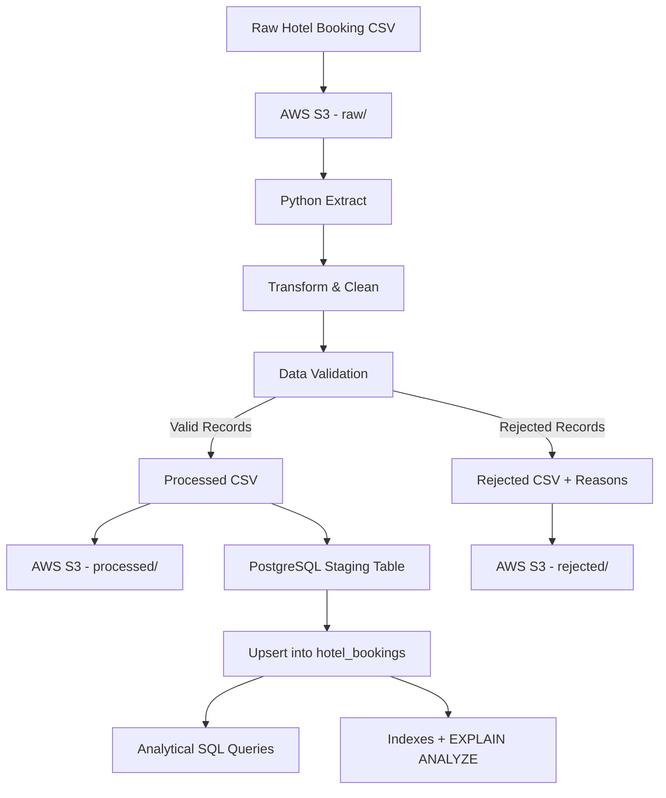

# Hotel Booking ETL Pipeline

A simple end-to-end Data Engineering project built for an Associate Data Engineer technical assessment.

The project extracts raw hotel booking data from AWS S3, cleans and transforms the data using Python, validates records, stores clean data in PostgreSQL, stores rejected records separately, and demonstrates analytical SQL queries and PostgreSQL query optimization.

---

## 1. Project Overview

This project uses a hotel booking dataset with:

- 119,390 raw records
- 36 source columns
- String, numeric and date-related data
- Missing values
- Duplicate records
- Inconsistent and invalid values





## 2. Technologies Used

- Python
- Pandas
- PostgreSQL
- SQLAlchemy
- Psycopg2
- AWS S3
- Boto3
- Python-dotenv
- Pytest

---

## 3. Dataset

The project uses a Hotel Booking dataset with approximately:

- 119,390 rows
- 36 columns

Example source columns:

```text
hotel
is_canceled
lead_time
arrival_date_year
arrival_date_month
arrival_date_day_of_month
stays_in_weekend_nights
stays_in_week_nights
adults
children
babies
country
market_segment
distribution_channel
is_repeated_guest
previous_cancellations
booking_changes
deposit_type
customer_type
adr
reservation_status
reservation_status_date
```

Some source fields such as customer name, email, phone number and credit card information are not required for the analytical model and are not loaded into the final PostgreSQL table.

### Dataset Source

```text
https://www.kaggle.com/datasets/mojtaba142/hotel-booking 
```

---

## 4. Project Structure

```text
hotel-booking-etl-pipeline/
│
├── data/
│   ├── raw/
│   ├── processed/
│   └── rejected/
│
├── logs/
│
├── src/
│   ├── __init__.py
│   ├── config.py
│   ├── database.py
│   ├── extract.py
│   ├── load.py
│   ├── logger.py
│   ├── s3_utils.py
│   ├── transform.py
│   └── validate.py
│
├── sql/
│   ├── schema.sql
│   ├── indexes.sql
│   ├── analytical_queries.sql
│   └── performance_queries.sql
│
├── tests/
│   ├── __init__.py
│   ├── test_transform.py
│   └── test_validate.py
│
├── run_pipeline.py
├── requirements.txt
├── pytest.ini
├── .env.example
├── .gitignore
└── README.md
```

---

## 5. ETL Process

The full pipeline can be executed using:

```bash
python run_pipeline.py
```

### Extract

The raw CSV file is stored in AWS S3.

Example:

```text
s3://hotel-booking-etl-saadfahim/raw/hotel_booking.csv
```

The pipeline reads the file from S3 using Boto3.

---

### Transform

The transformation stage performs:

- Duplicate removal
- Missing value handling
- String trimming
- Casing standardization
- Numeric type conversion
- Date conversion
- Derived column creation

The source arrival date is created from:

```text
arrival_date_year
arrival_date_month
arrival_date_day_of_month
```

and converted into:

```text
arrival_date
```

The following additional fields are created:

```text
total_nights =
stays_in_weekend_nights + stays_in_week_nights
```

```text
total_guests =
adults + children + babies
```

```text
booking_value =
adr * total_nights
```

```text
estimated_revenue =
booking_value if the booking is not cancelled
otherwise 0
```

---

### Validation

The pipeline validates records using rules such as:

- Hotel must not be null
- Country must not be null
- Arrival date must be valid
- Reservation status date must be valid
- Adults must be at least 1
- Children cannot be negative
- Babies cannot be negative
- Lead time cannot be negative
- ADR cannot be negative
- Total guests must be at least 1
- `is_canceled` must be 0 or 1
- `is_repeated_guest` must be 0 or 1

Invalid records are not silently deleted.

They are stored in:

```text
data/rejected/hotel_bookings_rejected.csv
```

Each rejected row contains a:

```text
rejection_reason
```

Example:

```text
missing country; negative adr
```

---

## 6. Booking ID

The original dataset does not contain a reliable natural booking ID.

Therefore, the pipeline creates a deterministic surrogate `booking_id`.

This ID is used as the PostgreSQL primary key and supports idempotent loading.

In a production system, the original source-system booking ID would be preferred.

---

## 7. Pipeline Results

The verified pipeline run produced:

| Metric | Result |
|---|---:|
| Raw records | 119,390 |
| Duplicate records removed | 33,132 |
| Records after transformation | 86,258 |
| Valid records | 85,430 |
| Rejected records | 828 |
| Rejection rate | 0.96% |

The final PostgreSQL table contains:

```text
85,430 records
```

---

## 8. PostgreSQL Database

The cleaned data is loaded into:

```text
hotel_bookings
```

The PostgreSQL schema includes:

- Primary key
- Appropriate data types
- NOT NULL constraints
- CHECK constraints
- Indexes

Examples of database constraints:

```sql
CHECK (is_canceled IN (0,1))
CHECK (is_repeated_guest IN (0,1))
CHECK (lead_time >= 0)
CHECK (adults >= 1)
CHECK (children >= 0)
CHECK (babies >= 0)
CHECK (total_guests >= 1)
CHECK (total_nights >= 0)
CHECK (adr >= 0)
CHECK (booking_value >= 0)
CHECK (estimated_revenue >= 0)
```

---

## 9. Database Loading and Idempotency

The load process uses:

```text
Clean DataFrame
      ↓
Staging Table
      ↓
Batch Load
      ↓
INSERT ... ON CONFLICT
      ↓
hotel_bookings
```

The pipeline uses an upsert strategy.

This means the pipeline can be executed multiple times without creating duplicate database records.

The pipeline was run more than once and the PostgreSQL row count remained:

```text
85,430
```

---

## 10. AWS S3 Integration

The pipeline uses AWS S3 for both input and output.

S3 structure:

```text
hotel-booking-etl-saadfahim/
│
├── raw/
│   └── hotel_booking.csv
│
├── processed/
│   └── hotel_bookings_cleaned.csv
│
└── rejected/
    └── hotel_bookings_rejected.csv
```

The pipeline:

1. Reads the raw dataset from S3
2. Processes the data
3. Uploads cleaned data to the `processed/` folder
4. Uploads rejected data to the `rejected/` folder

---

## 11. AWS IAM and Security

An AWS IAM user is used for programmatic access.

The IAM user follows the least-privilege principle.

Required permissions:

```text
s3:ListBucket
s3:GetObject
s3:PutObject
```

Access is restricted to the project S3 bucket.

AWS credentials are stored using environment variables.

No credentials are hardcoded in the source code.

The real `.env` file is excluded from GitHub.

---

## 12. Environment Variables

Create a `.env` file based on `.env.example`.

Example:

```env
AWS_ACCESS_KEY_ID=your_access_key
AWS_SECRET_ACCESS_KEY=your_secret_access_key
AWS_REGION=ap-southeast-1

S3_BUCKET_NAME=your_bucket_name
S3_RAW_KEY=raw/hotel_booking.csv
S3_PROCESSED_KEY=processed/hotel_bookings_cleaned.csv
S3_REJECTED_KEY=rejected/hotel_bookings_rejected.csv

DB_HOST=localhost
DB_PORT=5432
DB_NAME=hotel_etl
DB_USER=postgres
DB_PASSWORD=your_postgres_password

ALLOW_LOCAL_FALLBACK=false
```

Do not commit the real `.env` file.

---

## 13. Analytical SQL Queries

Analytical queries are available in:

```text
sql/analytical_queries.sql
```

The project includes more than the required three analytical queries.

### Query 1 - Monthly Revenue by Hotel

Returns:

- Month
- Hotel
- Booking count
- Estimated revenue

### Query 2 - Cancellation Rate by Country

Returns:

- Country
- Total bookings
- Cancelled bookings
- Cancellation rate

### Query 3 - Market Segment Performance

Returns:

- Market segment
- Booking count
- Average ADR
- Booking value
- Estimated revenue

Additional queries include:

- Top countries by booking count
- Average stay length by customer type

---

## 14. Query Optimization and Indexing

PostgreSQL `EXPLAIN ANALYZE` was used to measure query performance.

The performance test filtered bookings using:

```text
country = 'PRT'
```

and:

```text
arrival_date between 2016-01-01 and 2016-03-31
```

### Before Index

PostgreSQL used a:

```text
Sequential Scan
```

Results:

| Metric | Result |
|---|---:|
| Planning Time | 6.235 ms |
| Execution Time | 19.574 ms |
| Rows Removed by Filter | 82,083 |

### Index Added

A composite index was created:

```sql
CREATE INDEX idx_country_arrival
ON hotel_bookings(country, arrival_date);
```

### After Index

PostgreSQL used:

```text
Bitmap Index Scan
+
Bitmap Heap Scan
```

Results:

| Metric | Result |
|---|---:|
| Planning Time | 2.141 ms |
| Execution Time | 1.705 ms |

### Performance Comparison

| Metric | Before Index | After Index |
|---|---:|---:|
| Scan Type | Sequential Scan | Bitmap Index + Heap Scan |
| Planning Time | 6.235 ms | 2.141 ms |
| Execution Time | 19.574 ms | 1.705 ms |

For this test, query execution improved from:

```text
19.574 ms
```

to:

```text
1.705 ms
```

which is approximately an **11.5x improvement**.

Actual PostgreSQL execution plans may vary depending on:

- Data distribution
- Cache state
- PostgreSQL statistics
- Table size
- Query selectivity

---

## 15. Indexing Strategy

Indexes are created based on real query requirements.

Examples include:

```text
arrival_date
country
country + arrival_date
```

Indexes are not added to every column because indexes:

- Require additional storage
- Increase INSERT/UPDATE overhead
- Require maintenance

Indexes should be selected based on actual query patterns.

---

## 16. Scalability to 1 Million+ Records

The current pipeline processes approximately 119,000 records.

For 1 million or more records, the architecture can be improved in several ways.

### Chunked Processing

Instead of loading the entire dataset into memory:

```python
pd.read_csv(..., chunksize=...)
```

can be used.

This allows the dataset to be processed in smaller batches.

### Faster Processing

Depending on data size and transformation complexity:

- Pandas chunking
- Polars
- PySpark

could be considered.

Spark is not automatically required for one million records.

### S3 Partitioning

Raw files could be organized like:

```text
s3://bucket/raw/year=2026/month=10/day=06/data.csv
```

This would make incremental processing easier.

### PostgreSQL Partitioning

Large historical tables could be partitioned using:

```text
arrival_date
```

For example:

```text
hotel_bookings_2015
hotel_bookings_2016
hotel_bookings_2017
```

### Bulk Loading

For much larger datasets, PostgreSQL `COPY` could be used instead of normal batch inserts.

### Incremental ETL

Instead of processing all historical records every time, only new or changed records could be processed.

---

## 17. Scheduling

The current pipeline is executed manually:

```bash
python run_pipeline.py
```

For simple scheduled execution, a cron job or Windows Task Scheduler could be used.

For a production pipeline, Apache Airflow could be used for:

- Scheduling
- Workflow orchestration
- Dependency management
- Automatic retries
- Monitoring
- Execution history
- Failure alerts

Example:

```text
S3 Data Available
       ↓
Extract
       ↓
Transform
       ↓
Validate
       ↓
Load PostgreSQL
       ↓
Data Quality Check
```

---

## 18. Failure Handling

The pipeline handles two main types of failures.

### Data Quality Errors

Examples:

- Missing country
- Negative ADR
- Invalid dates
- Invalid guest values

These records are:

```text
Rejected
   ↓
Saved with rejection reason
   ↓
Pipeline continues
```

### Infrastructure Errors

Examples:

- AWS S3 unavailable
- Missing S3 object
- S3 upload failure
- PostgreSQL connection failure
- Database load failure

These errors cause the pipeline to:

```text
Log error
   ↓
Rollback database transaction where required
   ↓
Stop pipeline
```

The pipeline does not report success when a mandatory infrastructure step fails.

---

## 19. Logging

Logs are stored in:

```text
logs/pipeline.log
```

The pipeline logs:

- Pipeline start
- S3 extraction
- Source record count
- Duplicate count
- Transformation status
- Validation results
- Rejected record count
- S3 upload status
- PostgreSQL load status
- Pipeline success or failure

---


## 20. Running the Pipeline

Run:

```bash
python run_pipeline.py
```

Example successful output:

```text
====================================
HOTEL BOOKING ETL PIPELINE SUMMARY
====================================

Source records:             119390
Duplicates removed:         33132
Valid records:              85430
Rejected records:           828
Rejection percentage:       0.96%
Processed S3 upload:        successful
Rejected S3 upload:         successful
PostgreSQL load:            successful

Pipeline completed successfully.
====================================
```
